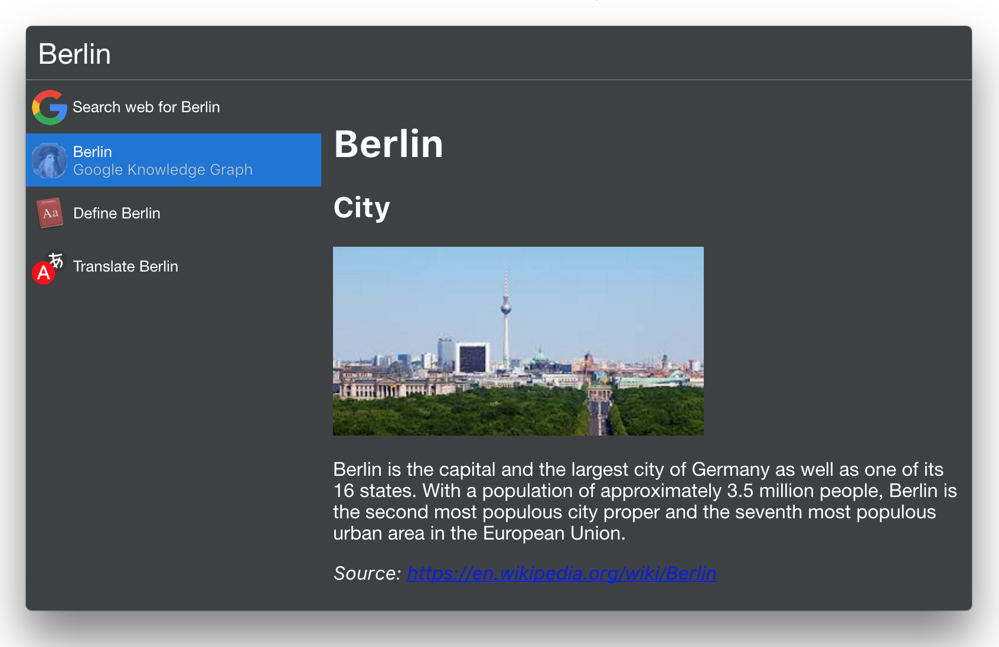

# Cerebro Google Knowledge Graph Plugin

> Get info from the [Google Knowledge Graph](https://www.google.com/intl/bn/insidesearch/features/search/knowledge.html) for your query

## Usage
* Just type any query and result from the Google Knowledge Graph will appear as the second result

## Related

* [Cerebro](http://github.com/KELiON/cerebro) – main repo for Cerebro app;
* [cerebro plugin boilerplate](https://github.com/KELiON/cerebro-plugin) – boilerplate used to create this plugin

## License

MIT © [Michael Seifarth](http://kageetai.net)
